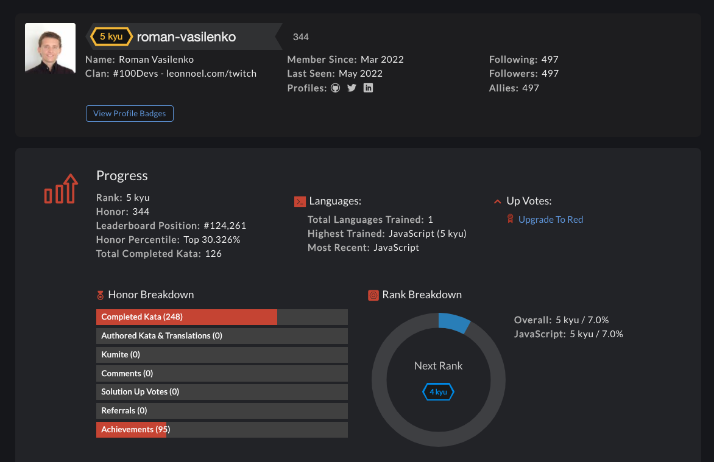

# CodeWars: Coding Challenges

A repository daily filled with JS coding challenges and solutions in various complexity and use cases.

**Link to my CodeWars Profile:** https://www.codewars.com/users/roman-vasilenko

## How It's Made

**Tech used:** 

At the end of every day, I am going through a few katas (coding challenges) to train my problem-solving skills and sharpen my code by looking at other devs' solutions.

## Optimizations

I consistently refactor and optimize my code, sometimes for efficiency, and sometimes for readability.

## Lessons Learned

There is a lot to learn to be able to solve any sort of challenge. It's fine if you can't figure out one, as long as you are willing to keep trying.
